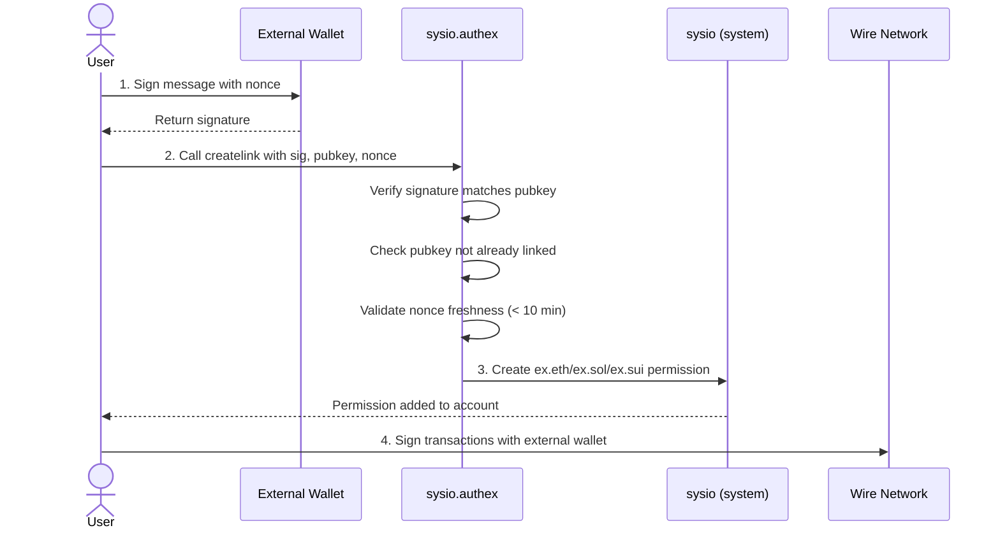

# `sysio.authex`

## Overview

The `sysio.authex` contract implements a cross-chain identity linking system for the Wire network. It allows users to cryptographically prove ownership of addresses on external blockchains (Ethereum, Solana, Sui) and link them to their Wire accounts. This enables users to sign Wire transactions using their external wallet (MetaMask, Phantom, etc.) while maintaining a secure, verifiable connection between identities across chains.

Below is a diagram describing the flow of operations:



## Supported Chains

| Chain | Chain Kind | Permission Created | Key Type |
|-------|-----------|-------------------|----------|
| Ethereum | `2` | `ex.eth` | `PUB_EM_` (secp256k1 + Keccak-256) |
| Solana | `3` | `ex.sol` | `PUB_ED_` (Ed25519) |
| Sui | `4` | `ex.sui` | `PUB_ED_` (Ed25519 + BCS encoding) |

## Actions

### `createlink`

Creates a cryptographic link between a Wire account and an external chain address. Upon successful verification, grants a special `ex.*` permission to the account.

| Parameter Name | Type | Description |
|---------------|------|-------------|
| `chain_kind` | `uint8` | The external blockchain identifier: `2` (Ethereum), `3` (Solana), `4` (Sui). |
| `account` | `name` | The Wire account name to link the external address to. |
| `sig` | `signature` | A valid signature from the external wallet, converted to Wire format. |
| `pub_key` | `public_key` | The external chain's public key in Wire format (`PUB_EM_` or `PUB_ED_`). |
| `nonce` | `uint64` | Timestamp in milliseconds. Must be within the last 10 minutes to prevent replay attacks. |

**Validation:**
- The `account` must authorize the action
- The `chain_kind` must be 2, 3, or 4
- The account must not already have a link for this chain
- The public key must not already be linked to another account (1:1 mapping)
- The nonce must be within 10 minutes of current time
- The signature must be valid for the constructed message

**Message Format:**
```
{pub_key}|{account}|{chain_kind}|{nonce}|createlink auth
```

**Chain-Specific Signing:**
- **Ethereum**: Message is hashed with Keccak-256
- **Solana**: Message is hashed with SHA-256, then mapped to printable ASCII
- **Sui**: Message is BCS-encoded, then hashed with Blake2b-256

**On Success:**
1. A record is added to the `links` table
2. An `ex.eth`, `ex.sol`, or `ex.sui` permission is created under `active`
3. The external public key is added to the account's `active` authority

### `onmanualrmv`

Internal notification handler that responds to `sysio::deleteauth` notifications. When a user's `ex.*` permission is removed, this action automatically updates the links table to maintain consistency.

| Parameter Name | Type | Description |
|---------------|------|-------------|
| `account` | `name` | The account that had the permission removed. |
| `permission` | `name` | The permission that was removed (`ex.eth`, `ex.sol`, or `ex.sui`). |

This is triggered automatically by the system when a user removes their external chain permission.

### `clearlinks`

**Testing only** - Clears all entries from the links table. This action will be removed before mainnet deployment.

| Parameter Name | Type | Description |
|---------------|------|-------------|
| — | — | No parameters. Requires contract authorization. |

## Tables

### `links`

Stores the mapping between Wire account names and their external chain identities.

| Field | Type | Description |
|-------|------|-------------|
| `key` | `uint64` | Auto-incrementing primary key. |
| `username` | `name` | Wire account name of the user. |
| `chain_kind` | `uint8` | External blockchain identifier (2=Ethereum, 3=Solana, 4=Sui). |
| `pub_key` | `public_key` | External chain's public key in `PUB_EM_` or `PUB_ED_` format. |

**Secondary Indices:**
- `bynamechain` - Composite index of `(account << 64 | chain_kind)`. Ensures one link per chain per account.
- `byname` - Index by account name. Enables lookups of all links for an account.
- `bypubkey` - SHA-256 hash of the public key. Enforces 1:1 public key uniqueness.
- `bychain` - Index by chain kind. Enables lookups by blockchain type.

## The `ex.*` Protected Namespace

Permissions starting with `ex.` are protected:

- Only the `sysio` system account can create or modify these permissions
- They are managed exclusively through the `sysio.authex` contract
- Users cannot manually create `ex.*` permissions

This protection ensures that external chain bindings are cryptographically verified and cannot be spoofed.

## Security Considerations

- **Replay Protection**: The 10-minute nonce window prevents replay attacks while allowing reasonable time for transaction submission.
- **1:1 Mapping**: Each external public key can only be linked to one Wire account, preventing identity conflicts.
- **Signature Verification**: All signatures are cryptographically verified using the appropriate algorithm for each chain.
- **Protected Permissions**: The `ex.*` namespace is protected at the system level, preventing unauthorized permission creation.

## Related Documentation

- [Multi-Chain Keys](/docs/smart-contract-development/multi-chain-keys.md) - Overview of multi-chain key support
- [Key Formats](/docs/api-reference/tooling/kiod/key-formats.md) - Supported key types including EM and ED
- [Accounts & Permissions](/docs/smart-contract-development/accounts-permissions.md) - Permission hierarchy and special permissions
