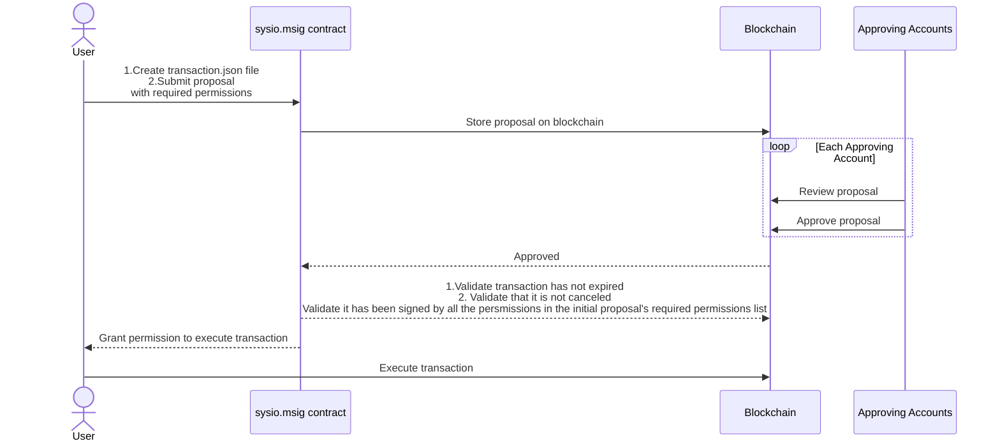

# `sysio.msig`

## Overview

The `sysio.msig` contract facilitates the management of multi-signature proposals on a Wire-based blockchain. It enables creating, approving, and executing proposed transactions which require authorization from multiple accounts.

Below is a diagram describing the flow of operations:

## Actions

### `propose`

Creates a proposal for a transaction that requires approvals from specified permission levels.

| Parameter Name  | Description |
|-----------------|-------------|
| `proposer`      | The account proposing the transaction. |
| `proposal_name` | Unique name for the proposal. |
| `requested`     | List of permission levels expected to approve the proposal. |
| `trx`           | The transaction proposed for execution. |

It allows a `proposer`(an account) to make a `proposal_name`(proposal) which has `requested` permission levels needed to approve the proposal.

### `approve`

Approves n existing proposal.

| Parameter Name  | Description |
|-----------------|-------------|
| `proposer`      | The account that initiated the proposal. |
| `proposal_name` | The name of the proposal to approve. |
| `level`         | The permission level that is approving the proposal. |
| `proposal_hash` | The checksum of the transaction being approved. |

It allows an account, the owner of `level` permission, to approve a proposal `proposal_name` proposed by `proposer`.

If the proposal's requested approval list contains the `level` permission required, then the `level` permission is moved from `requested_approvals` list to `provided_approvals` list of the proposal, thus persisting the approval for
the proposal. Storage changes are billed to `proposer`.

### `unapprove`

Revokes approval of a proposed transaction(reverse of the `approve` action).

| Parameter Name  | Description |
|-----------------|-------------|
| `proposer`      | The account that initiated the proposal. |
| `proposal_name` | The name of the proposal to unapprove. |
| `level`         | The permission level revoking approval. |

If all validations pass, the `level` permission is erased from internal `provided_approvals` and added to the internal
`requested_approvals` list, and thus un-approve or revoke the proposal.

### `cancel`

Cancels an existing proposal.

| Parameter Name  | Description |
|-----------------|-------------|
| `proposer`      | The account that initiated the proposal. |
| `proposal_name` | The name of the proposal to be canceled. |
| `canceler`      | The account responsible for canceling the proposal. |

Allows the `canceler` account to cancel the `proposal_name` proposal, created by a `proposer`,
only after time has expired on the proposed transaction. It removes corresponding entries from internal tables.

### `exec`

Executes a proposal that has been approved by all required permission levels.

| Parameter Name  | Description |
|-----------------|-------------|
| `proposer`      | The account that initiated the proposal. |
| `proposal_name` | The name of the proposal to execute. |
| `executer`      | The account executing the proposal. |

Prerequisites for `exec` action:

* `executer` has authorization
* `proposal_name` is found in the proposals table
* all requested approvals have been received
* proposed transaction is **not** expired
* and approval accounts are not found in invalidations table

If all prerequisites are met, the transaction is executed as a *deferred transaction*,
and the proposal is erased from the proposals table.

### `invalidate`

Invalidates the sender’s approvals, preventing execution of any dependent proposals.

| Parameter Name  | Description |
|-----------------|-------------|
| `account`       | The account invalidating its own approvals. |

## Tables and Storage

### `proposal`

Stores the details of each proposed transaction.

### `approvals`

Manages the approvals needed and given for each proposal.

### `invalidation`

Keeps track of invalidated approvals to ensure they are not used in executing proposals.
