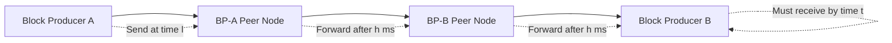
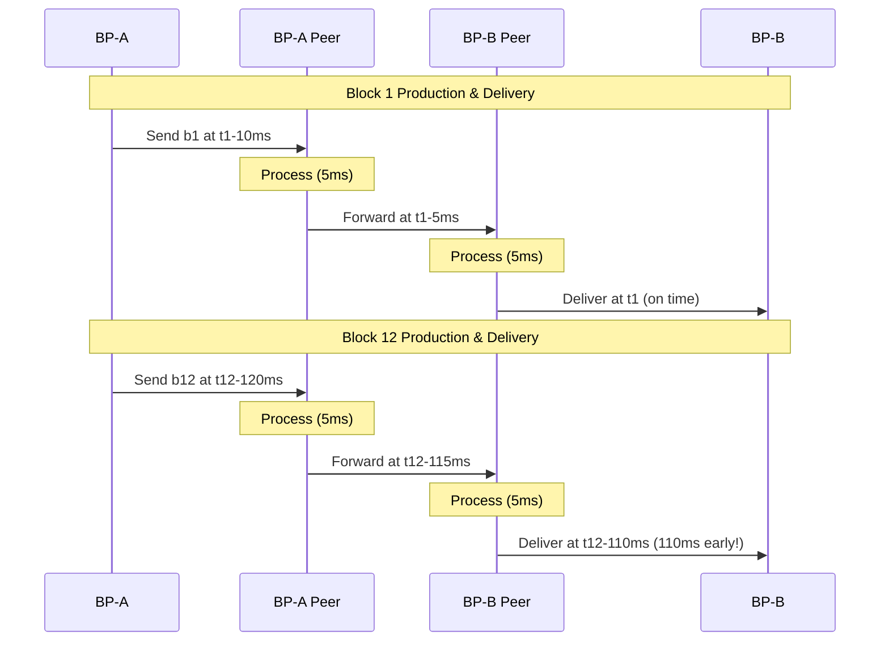
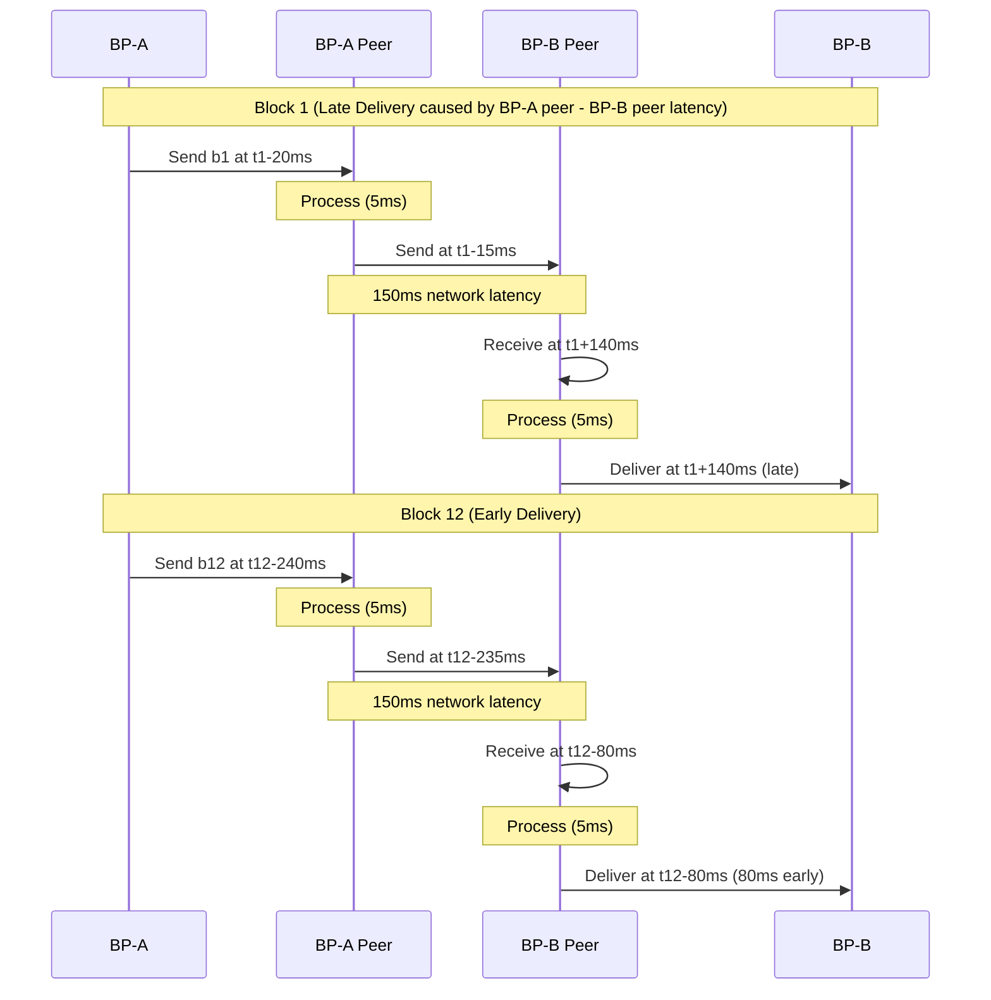
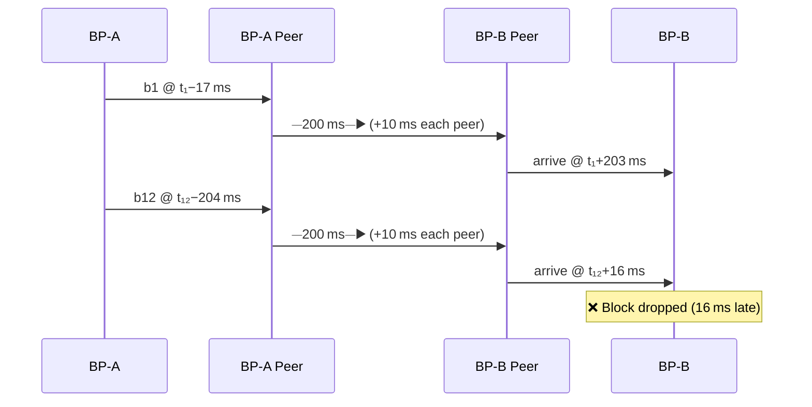
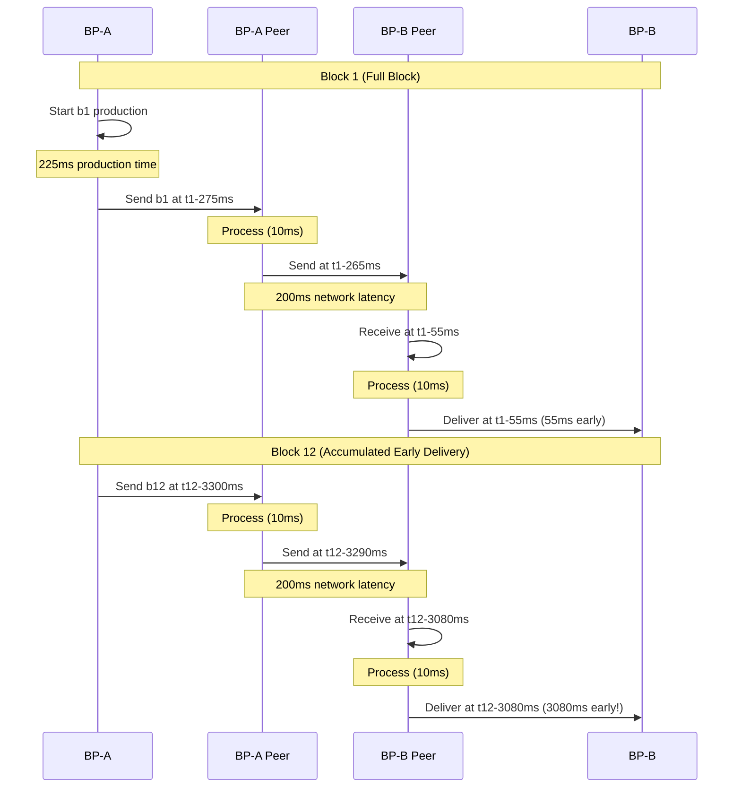

## Overview

Block production involves complex timing mechanisms to ensure efficient and reliable blockchain operations. This guide explains how block producers coordinate to maintain network consensus, with detailed examples showing different network scenarios.

## Key Concepts and Variables

Understanding block production requires familiarity with several key variables and timing mechanisms:

| Variable | Value | Description |
|----------|-------|-------------|
| `r` | 12 | **Producer Repetitions** - Number of blocks each producer creates in their turn |
| `m` | varies | **Max Block CPU Usage** - Maximum CPU time allowed per block (consensus parameter) |
| `u` | varies | **Max Block Net Usage** - Maximum network bandwidth per block (consensus parameter) |
| `t` | varies | **Block Time** - When a block should be finalized |
| `e` | config | **Produce Block Offset** - Configuration setting in nodeop |
| `w` | 500ms | **Block Time Interval** - Fixed time between blocks |
| `a` | `e/r` ms | **Early Release Time(ms)** - Block release offset |
| `l` | `t-a` | **Produce Block Time** - When block production actually starts |
| `p` | `w-a` | **Production Window** - Available time to produce a block |
| `c` | `min(m, w-a)` | **Billed CPU Time** - Actual CPU time charged for the block |
| `n` | varies | **Network Latency** - Time for data to travel between nodes |
| `h` | varies | **Block Header Validation Time** - Time to validate block headers |

## Network Topology

Block producers operate in a network where timing is critical. Let's consider the example of the following two BPs and their network topology as depicted in the below diagram



## How Block Rounds Work

Each block producer creates 12 consecutive blocks during their turn at a fixed interval of 500ms:

```mermaid
gantt
    title Block Production Round (BP-A)
    dateFormat X
    axisFormat %s
    
    section BP-A Blocks
    Block 1    :0, 500
    Block 2    :500, 1000
    Block 3    :1000, 1500
    Block 4    :1500, 2000
    Block 5    :2000, 2500
    Block 6    :2500, 3000
    Block 7    :3000, 3500
    Block 8    :3500, 4000
    Block 9    :4000, 4500
    Block 10   :4500, 5000
    Block 11   :5000, 5500
    Block 12   :5500, 6000
    
    section BP-B Preparation
    BP-B Start :5500, 6000
```



`BP-A` will send block at `l` and, `BP-B` needs block at time `t` or otherwise will drop it.

If `BP-A`’s schedule is:
> b₁ @ t1, b₂ @ t1.5, b₃ @ t2, b₄ @ t2.5, … up to b₁₂ @ t6.5,
then `BP-B` must receive b₁₂ no later than t 6.5. That leaves `BP-B` the remaining 0.5 s of the slot to begin producing its own first block (b₁₃ @ t7).

The last block time of BP-A (t 6.5) is therefore the hand-off moment: BP-A finishes, BP-B must immediately start.

A block is produced and sent when either it reaches `m` or `u` or `p`.

Blocks are propagated after block header validation. This means instead of `BP-A Peer` & `BP-B Peer` taking `m` time to validate and forward a block it only takes a small number of milliseconds to verify the block header and then forward the block.

### Block Timing in Wire Sysio v5.0

Blocks start immediately after the previous block completes, with all _sleep_ moved to the end of the round

## Examples

### Context

Each example analyzes **one full production round** — 12 blocks created by a single producer ( `r = 12` ) and block interval is `w = 500ms`.  
The question is always the same:

> **Will the last block of BP-A’s round reach BP-B in time for BP-B to begin its own production?**

To answer that, every scenario plugs its specific numbers into the same core equation:

```math
\boxed{\Delta_i = C - i\,a} \;
```

- `Δᵢ` is the arrival offset for block _i_
- `C` is the fixed travel cost between `BP-A` and `BP-B`(`C = 2h + n` -> the total time a block takes to travel from `BP-A` to `BP-B` equals 2 header-validation steps—one at each peer(2 h) plus any network latency (n))
- `a` (`a = e / r`) is the fixed amount of time by which each block is released ahead of its scheduled slot.

_Interpretation_  

- **Δᵢ > 0** → block _i_ arrives _late_ by Δᵢ.  
- **Δᵢ < 0** → block _i_ arrives _early_ by |Δᵢ|.

The examples show how varying **C**  or **a**  moves the last block from late, to on-time, early or, in the worst case - late and dropped.

### Example 1: Block Arrives 110ms Early

#### Scenario Setup

- 0 network latency between all nodes
- Blocks don't reach CPU limit (`m`), so they take full production time (`w-a`)
- Block completion and signing take zero time
  
BP-A settings:

| Symbol | Value |
|--------|-------|
| `e` | **120 ms** |
| `a = e / r` | **10 ms** |
| `h` | **5 ms** |
| `n` | **0 ms** |

```math
\boxed{\Delta_i = C - i\,a} \;\Longrightarrow\;
\Delta_i = 10\,\text{ms} - 10\,i
```

#### Diagram (Blocks 1 & 12)



#### Timeline Table

| Block _i_ | BP-A sends @ | Arrives BP-B @ | Offset Δᵢ |
|:--:|:--|:--|:--|
| 1  | `t₁ − 10 ms` | `t₁`           | 0 ms (on-time) |
| 2  | `t₂ − 20 ms` | `t₂ − 10 ms`   | 10 ms early |
| …  | …            | …              | … |
| 11 | `t₁₁ − 110 ms` | `t₁₁ − 100 ms` | 100 ms early |
| 12 | `t₁₂ − 120 ms` | `t₁₂ − 110 ms` | **110 ms early** |

### Example 2: Block Arrives 80ms Early

#### Scenario Setup

- 0 latency between BP-A ↔ BP-A Peer and BP-B Peer ↔ BP-B
- 150ms latency between BP-A Peer ↔ BP-B Peer

BP-A settings:

| Symbol | Value |
|--------|-------|
| `e` | **240 ms** |
| `a = e / r` | **20 ms** |
| `h` | **5 ms** |
| `n` | **150 ms** |
| `C = 2h + n` | **160 ms** |

```math
\boxed{\Delta_i = C - i\,a} \;\Longrightarrow\;
\Delta_i = 160\,\text{ms} - 20\,i
```

#### Diagram (Blocks 1 & 12)



#### Timeline Table

| Block _i_ | BP‑A sends @ | Arrives BP‑B @ | Offset Δᵢ |
|:--:|:--|:--|:--|
| 1 | `t₁ − 20 ms` | `t₁ + 140 ms` | 140 ms **late** |
| 2 | `t₂ − 40 ms` | `t₂ + 120 ms` | 120 ms late |
| 3 | `t₃ − 60 ms` | `t₃ + 100 ms` | 100 ms late |
| 4 | `t₄ − 80 ms` | `t₄ + 80 ms`  | 80 ms late |
| 5 | `t₅ − 100 ms`| `t₅ + 60 ms`  | 60 ms late |
| 6 | `t₆ − 120 ms`| `t₆ + 40 ms`  | 40 ms late |
| 7 | `t₇ − 140 ms`| `t₇ + 20 ms`  | 20 ms late |
| 8 | `t₈ − 160 ms`| `t₈`           | **on time** |
| 9 | `t₉ − 180 ms`| `t₉ − 20 ms`  | 20 ms **early** |
| 10| `t₁₀ − 200 ms`| `t₁₀ − 40 ms` | 40 ms early |
| 11| `t₁₁ − 220 ms`| `t₁₁ − 60 ms` | 60 ms early |
| 12| `t₁₂ − 240 ms`| `t₁₂ − 80 ms` | **80 ms early** |

---

### Example 3: Block Arrives 16ms Late and Gets Dropped

#### Scenario Setup

- 200ms latency between BP-A Peer ↔ BP-B Peer

- BP-A settings:

| Symbol | Value |
|--------|-------|
| `e` | **204 ms** |
| `a = e / r` | **17 ms** |
| `h` | **10 ms** |
| `n` | **200 ms** |
| `C = 2h + n` | **220 ms** |

---

```math
\boxed{\Delta_i = C - i\,a} \;\Longrightarrow\;
\Delta_i = 220\,\text{ms} - 17\,i
```

---

#### Diagram (Blocks 1 & 12)



---

#### Timeline Table

| Block _i_ | BP‑A sends @ | Arrives BP‑B @ | Offset Δᵢ |
|:--:|:--|:--|:--|
| 1  | `t₁ − 17 ms`  | `t₁ + 203 ms` | **+203 ms late** |
| …  | … | … | … |
| 11 | `t₁₁ − 187 ms`| `t₁₁ + 33 ms` | +33 ms late |
| **12** | `t₁₂ − 204 ms`| `t₁₂ + 16 ms` | **+16 ms late → dropped** |

---

### Example 4: Full blocks are produced early

#### Scenario Setup

- 0 network latency between `BP-A` & `BP-A Peer` and between `BP-B Peer` & `BP-B`.
- 200ms network latency between `BP-A Peer` & `BP-B Peer`.
- Assume all blocks are full as there are enough queued up unapplied transactions ready to fill all blocks.
- Assume a block can be produced with 200ms worth of transactions in 225ms worth of time. There is overhead for producing the block.

- BP-A settings:

| Symbol | Value  | Description |
|----------|------------------|-------------|
| `e`| **120 ms** | Early release time in ms (`produce-block-offset`) |
| `a = e / r` | **10 ms** | Early release time in ms per block |
| `m`| **200 ms** | Max CPU payload per block (`max_block_cpu_usage`) |
| `p = w − a` | **490 ms** | Production window each slot |
| **build time** | **225 ms** | Real time to build a full block (200 ms tx + 25 ms overhead) |
| `c = min(m, w − a)`| **200 ms** | CPU billed for a full block |
| `n` | **200 ms** | Network latency (BP-A Peer → BP-B Peer) |
| `h` | **10 ms** | Header-validation time at each peer |
| `C= 2h + n` | **220 ms** | Fixed travel cost per block |

---

#### Diagram (Blocks 1 & 12)



#### Timeline Table

BP‑A starts each new block **225 ms** and also shifts an extra **10 ms earlier** per block.

| Block _i_ | BP‑A **send** @ | Arrives BP‑B @ | Offset Δᵢ |
|:--:|:--|:--|:--|
| 1 | `t₁ − 275 ms` | `t₁ − 55 ms` | **55 ms early** |
| 2 | `t₂ − 550 ms` | `t₂ − 330 ms` | 330 ms early |
| 3 | `t₃ − 825 ms` | `t₃ − 605 ms` | 605 ms early |
| … | … | … | … |
| 11 | `t₁₁ − 3025 ms` | `t₁₁ − 2805 ms` | 2805 ms early |
| **12** | `t₁₂ − 3300 ms` | `t₁₂ − 3080 ms` | **3080 ms early** |
