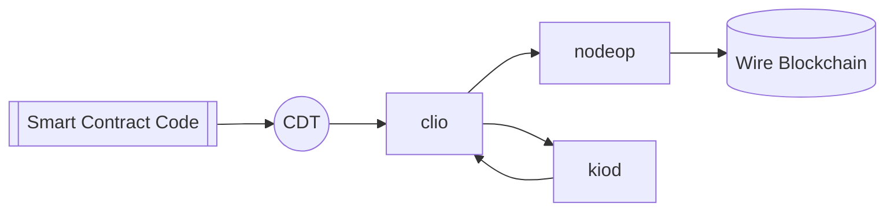

# Basic Components

Wire Network blockchain platform comes with various components and tooling. See the table below for a brief explanation of each component.

| Name | Function |
| --- | --- |
| `nodeop` | nodeop is the **core service daemon** that runs on every Wire node, responsible for processing smart contracts, validating transactions, producing blocks containing valid transactions, and confirming blocks to record them on the blockchain. It can be configured with various plugins to suit specific needs, including block production, dedicated API endpoints, and local development environments. As the main component of Wire, nodeop ensures efficient and secure operation of the blockchain network by leveraging its capabilities for transaction validation, smart contract processing, and block confirmation. |
| `kiod` | kiod is the **key manager service daemon** that securely stores private keys and signs digital messages. It ensures that keys are encrypted at rest in the associated wallet file and provides a secure enclave for signing transactions created by `clio` or third-party libraries. |
| `clio` | clio is a CLI that interfaces with the REST API exposed by nodeop. It also allows developers to deploy and test Wire smart contracts. |
| `CDT` | The Contract Development Toolkit is a C/C++ toolchain targeting WebAssembly (WASM) and a set of tools to facilitate development and deployment of smart contracts written in C/C++. In addition to being a general-purpose WebAssembly toolchain, Wire-specific optimizations are available to support building Wire smart contracts. This new toolchain is built around Clang 7, which means that CDT has most of the current optimizations and analyses from LLVM. |

The basic relationship between these components is illustrated in the following diagram:

## Reference

- [nodeop](/docs/api-reference/tooling/nodeop/index.md)
- [clio](/docs/api-reference/tooling/clio/index.md)
- [kiod](/docs/api-reference/tooling/kiod/index.md)

:::info[NOTE]

`kiod` can be accessed using the Wallet API, but it is important to note that the intended usage is for local light client applications. kiod is not for cross network access by web applications trying to access users' wallets.
:::

- [CDT Contract Development Kit](/docs/api-reference/tooling/cdt/index.md)
<!-- CDT is a toolchain for WebAssembly (Wasm) and a set of tools to facilitate contract writing for the Wire framework. In addition to being a general-purpose WebAssembly toolchain, Wire-specific optimizations are available to support building Wire smart contracts. This new toolchain is built around Clang 7, which means that CDT has most of the current optimizations and analyses from LLVM. -->

:::info[NOTE]

Wire also provides a collection of JavaScript libraries published under [@wireio npm org](https://www.npmjs.com/org/wireio).

:::
