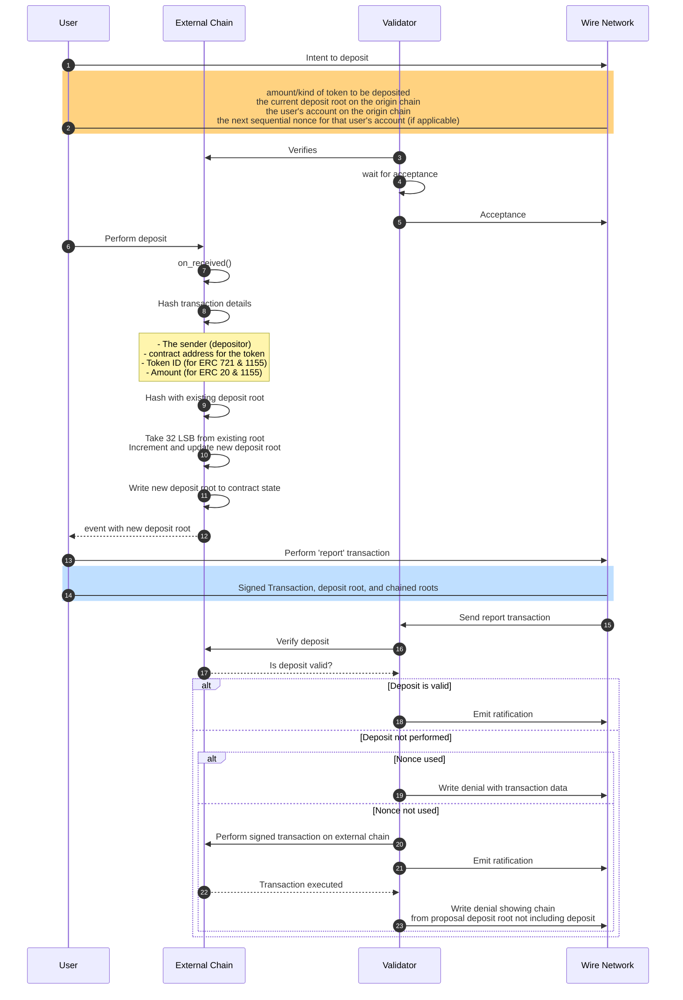

# Deposits

Before users can transact with tokens on the Wire network, their tokens must be ‘shadowed’ from the origin chain. Shadowing, also known as token wrapping, is creating a digital representation of a token from one blockchain on another. For example, Ethereum (ETH) on the Wire Network is represented as Wrapped Ethereum (WETH) to enable its use within that specific ecosystem.
The deposit process involves *transferring the ownership of the tokens to a special escrow contract*, where they are held until the eventual recipient decides to claim them. This contract serves as the foundational mechanism for managing the *deposit root*, which is essential for tracking and verifying the deposits within the network.

## Deposit Root

The deposit root is a dynamic cryptographic hash used as a cumulative verification point within the escrow account on the external chain.

- **Initialization and Update**: The deposit root is initialized with a deterministic value. Each transaction updates this root by hashing the transaction details with the existing deposit root value and incorporating a sequential identifier to ensure traceability.
- **Proof Construction**: This updating mechanism facilitates the creation of a verifiable proof that includes the initial deposit root value, detailed transaction information, and all subsequent transaction hashes.
Below is a detailed diagram of the deposit flow of operations:

