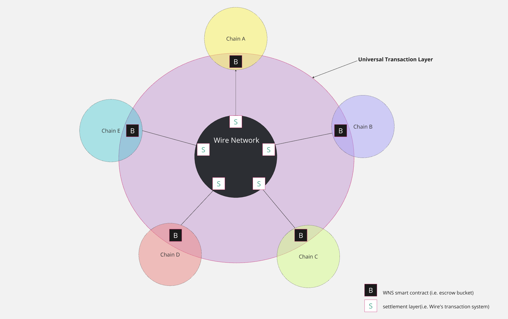
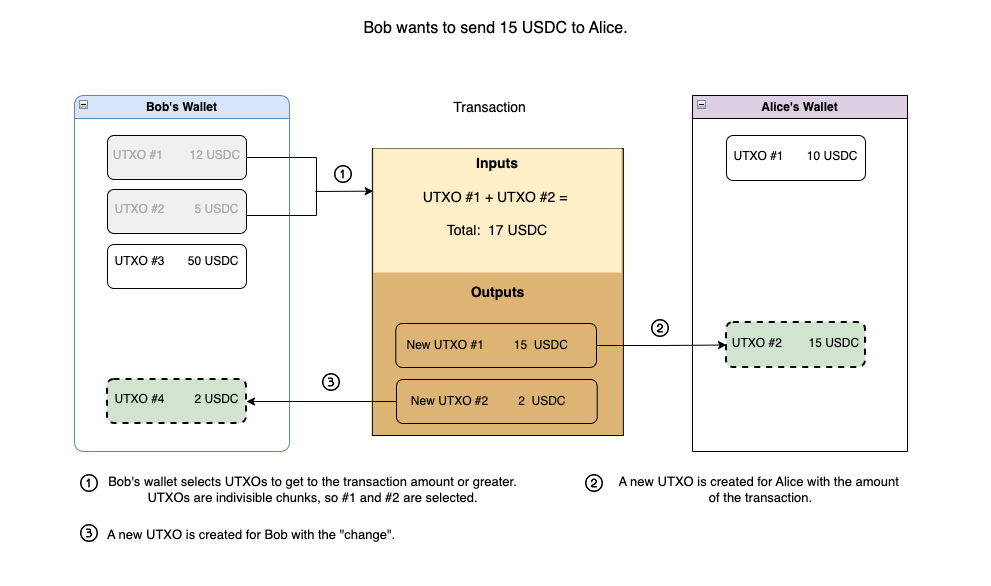

# Interoperability & WNS

## Introduction

Blockchain interoperability is the ability different blockchains to communicate and exchange data while maintaing decentralization. With the growing number of blockchain networks and projects launched in the last decade, each with diverse protocols and architechture, and adding the lack of standardization for cross-chain communication,the dream of one-solution-fits-all remains elusive. Many companies in the blockchain landscape have attempted to create different solutions, like traditional bridges and variations of those, side-chains, parachains, messaging protocols and many others.

Solutions like Chainlink, Layer 0, Wormhole, Polkadot, Cosmos differ from one another, but have one thing in common - they are gateways for potential security vulnerabilities and/or decentralization is compromised by relying on a 3rd party entity for cross-chain transactions. Bridges or oracles or combination of those have been and most likely are always going to be the prime target for malicious activities, due to their flawed architechture. Dependence on centralized components also affects security - centralized points that can be attacked or compromised, as evidenced by various security breaches throughout the years. Moreover, such models drift away from the decentralized ideal and transperancy of the trasaction system even further.

Additionally due to the heterogenous nature of blockchain technology, there is the persistent issue of those solutions' compatibility with new and existing networks; they are inherently limited by the number of chains that they can support.

In its core, Wire Name Service(WNS) is a collection of multiple settlement layers spaning across supported blockchains, collectively forming Wire's *universal transaction layer*.

WNS aims to achieve true interoperability through efficient, low-cost, and high-throughput transactions while maintaining high security and operational integrity. This article explores the details of WNS’s architecture and processes.

## Design

WNS's design is a hub-and-spoke model(see diagram below). This design enables transactions between different blockchain networks through a central hub, providing a seamless, secure and cost-efficient way for assets to move between chains.

## Settlement Layer

The settlement layer is the backbone transaction system of Wire Network, responsible for managing the flow of assets into, within, and out of the network.
It is comprised of native settlement and target chain('escrow' or 'bucket') contracts, each with distinct functions at the different stages of an asset’s lifecycle.
Settlement layer may exist for different asset types and subsets of assets on the target blockchain. These contracts are designed to be chain-agnostic, offering several significant advantages:

- **Scalability** Settlement layer's structure can be replicated and adapted to any EVM-based or EOS-based blockchains.
- **User Experience** Users can perform cross-chain transactions without needing to understand or interact with the underlying mechanics and complexities of each blockchain.

In practical terms, a settlement contract linked to the hub can interface with multiple chains through interactions with escrow contract(s) deployed on the origin chains. When assets enter the hub in the form of wrapped tokens, transactions can occur within the network itself (i.e., the hub), without actually leaving the origin chain.

## Security Principles

The security framework of WNS is robust, relying on multiple checks and balances to prevent malicious activities. Key features are the use of standard cryptographic proofs to verify transactions, implementation of UTXO model to track transaction outputs; as well utilizing a completely independent sub-chain to aid with the transaction verification process. This sub-chain, also knowns as S-chain(stands for *settlement*) includes only the relevant transactions and data needed for the target chain, allowing for fast and efficient processing.

### UTXO

The UTXO (Unspent Transaction Output) model views each token amount as a distinct, single-use account that is fully spent in every transaction. Every time a transaction occurs, the involved UTXOs are completely used and split into new UTXOs. In Wire Network, for example, instead of maintaining a single large balance, users have multiple UTXOs representing different amounts. This model supports efficient backtracking to specific deposits and is useful in scenarios where transactions need to be challenged or verified.

**Example:**

Bob wants to send 15 USDC to Alice. To complete the transaction, Bob’s wallet selects UTXOs that equal or exceed the required amount. UTXO #1 (12 USDC) and UTXO #2 (5 USDC) are selected, which together are total of 17 USDC.

The transaction consumes these UTXOs fully, creating two new outputs:

1. A new UTXO of 15 USDC for Alice, reflecting the amount Bob sent.
2. A new UTXO of 2 USDC for Bob, which is the leftover or “change” from the original UTXOs.

After the transaction, Bob now holds a new UTXO of 2 USDC, and Alice has a new UTXO of 15 USDC.

**Read more about:**

- [Deposits](./deposits.md)
- [Transaction lifecycle explained](./wns-trx-flow.md)
