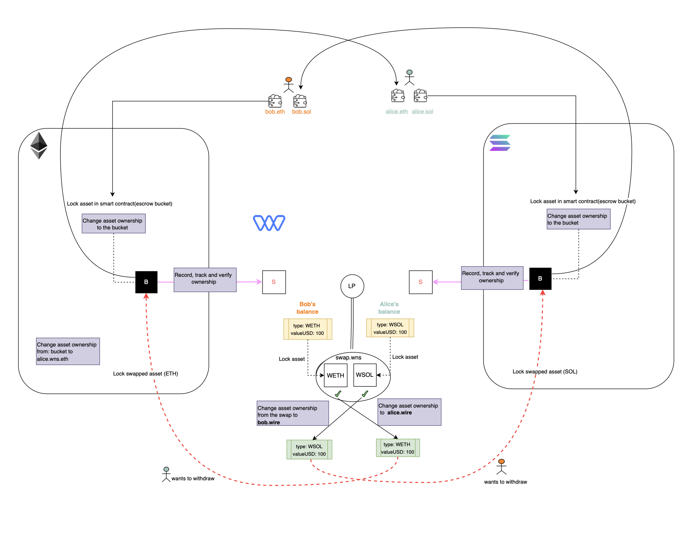

# WNS Transaction Flow

Below is an example of a diagram that visualizes deposit, swap and withdrawal for two hypothetical users - Bob and Alice.
Bob possesses $100 of ETH on Ethereum and Alice has $100 of SOL on Solana, both stored in their respective UPAP-enabled wallets. Upon successful deposits, Bob and Alice have respectively their wrapped tokens WETH and WSOL.
If they wish to swap these assets, the WNS system can perform an atomic swap on the Wire blockchain via the swap contract.
Either party can initiate this transaction using their UPAP-enabled wallet. For instance, Bob proposes a transaction to exchange his $100 in ETH for Alice's $100 in SOL. Alice then finalizes the transaction in her UPAP-enabled wallet, resulting in the updated ownership being confirmed and reflected in the WNS system.
Bob and Alice then decide to withdraw their assets - Bob would now have $100 of SOL in his Solana wallet, and Alice - $100 of ETH in her ETH.

