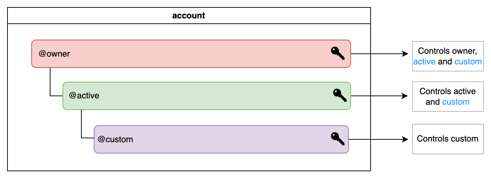
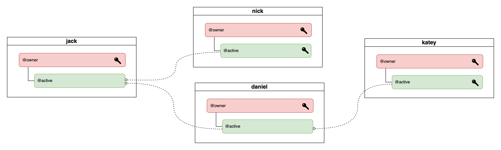
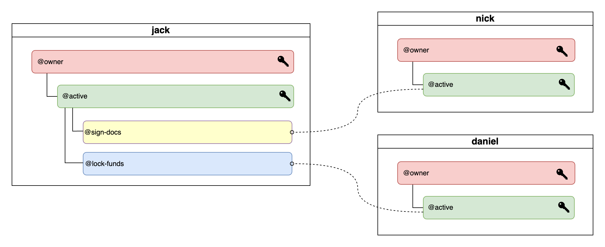
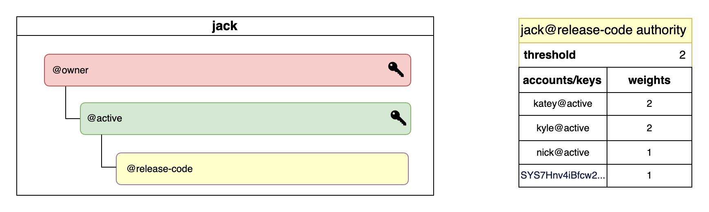

# Accounts & Permissions

A Wire account is a digital entity on the blockchain that identifies a participant, which can be an individual or a group. An account also represents the smart contract actors that send and receive actions to and from other accounts on the blockchain. Actions, which are the fundamental units of execution, are always encapsulated within transactions, allowing for one or more atomic actions to be grouped together.

See account name restrictions [here](/docs/introduction/glossary.md#account-name).

## Public & Private Keys

Every Wire account is ultimately controlled by a key pair (public and corresponding private key). While the public key is used to identify the account on the blockchain and can be publicly known, the private key which is used to sign each transaction **must be kept secret at all times**.

If you lose your private key, you will lose access to your account and all of its assets, smart contracts, and any other data associated with it.

## Permissions

Each account has a set of hierarchical permissions that control what that account can do and how actions are authorized. By default, each account comes with two base permissions  - `owner` and `active`. These two permissions are mandatory and they cannot be removed. A permission can only modify its own controls (keys or accounts) or those of its children, but **never those of its parent.**

### Owner Permission

The `owner` permission is the highest in an account’s hierarchy, usually reserved for recovery scenarios when lower permissions are compromised. It can perform any action that lower permissions can, but keys for this permission are generally stored offline in cold storage to avoid misuse.

### Active Permission

The `active` permission is the default for all actions, sitting just below the `owner` permission. It handles typical account activities, but cannot alter owner keys. Custom permissions usually are created under the `active` and linked to specific contracts or actions.

.

A permission is linked to and controlled by either a **public key** or another **account**. This allows for the creation of complex account control structures, where multiple parties may control a single account while still having full autonomy over their own account's security.

See the diagram below as an example, where the account `jack@active` is controlled by both `nick@active` and `daniel@active`, and on the other hand, `daniel@active` is also controlled by `katey@active`.

### Permission Mapping

It is possible to create custom permissions scoped to specific actions within a designated contract, also known as *permission mapping*. That permission will then only ever be able to interact with the contract action you specified. Such setup allows for very granular access permissions across accounts and hierarchical structures tailored to your needs.

### Permission Evaluation

When determining whether an action is authorized to be executed, the wire-sysio software:

- first checks whether the signatures provided in the transaction are valid.
- then it proceeds to check the authorization of all the actions included in the transaction. This is where permissions are evaluated. If any action fails to be authorized, the transaction fails.

#### Authority Table

Each account's permission can be linked to an `authority` table used to determine whether a given action authorization can be satisfied. The authority table contains the target permission name and threshold, the factors and their weights, all of which are used in the evaluation to determine whether the authorization can be satisfied. The permission threshold is the target numerical value that must be reached to satisfy the action authorization (see `authority` schema below).

#### `authority` schema

Name | Type | Description
-|-|-
`threshold` | `uint32_t` | threshold value to satisfy authorization
`keys` | array of `key_weight` | list of public keys and weights
`accounts` | array of `permission_level_weight` | list of `account@permission` levels and weights
`waits` | array of `wait_weight` | list of time waits and weights

The `key_weight` type contains the actor's public key and associated weight. The `permission_level_weight` type consists of the actor's `account@permission` level and associated weight. The `wait_weight` contains the time wait and associated weight (used to satisfy action authorizations in delayed user transactions. All of these types allow to define lists of authority factors that are used for satisfaction of action authorizations.

#### Authority Factors

Every authority table linked to a given permission lists potential factors explicitly used in the evaluation of the action authorization. A factor type can be one of the following:

- Actor's account name and permission level
- Actor's public key
- Time wait

The potential actors who may execute the action are specified by either **public key** or **account name** in the `authority` table. Time waits are special factors which are satisfied by publishing a transaction with a delay in excess of the defined time. These carry weights as well that may contribute to satisfy the threshold.

#### Authority Threshold

Authorization over a given action is determined by satisfying all explicit authorizations specified in the action instance. Those are in turn individually satisfied by evaluating each *factor* (account, public key, wait) for satisfaction and summing the weights of those that are satisfied. If the sum equals or exceeds the weight threshold, the action is authorized.

**Example:**

The authority table for `jack`'s `release-code` named permission is shown in the diagram below. In order to authorize an action under that permission, a threshold of 2 must be reached.

Since both `katey@active` and `kyle@active` factors have a weight of 2, *either one can satisfy the action authorization*. This means that either `katey` or `kyle` with a permission level of `active` or higher can independently execute any action under `jack`'s `release-code` permission.

Alternatively, it would require two acounts each with weight of 1 to satisfy the action authorization - in this case account with public key `SYS7Hnv4iBfcw2...` and `nick@active`.

## How Authorization Works

When you push a transaction, two separate checks happen:

### Layer 1: The Node Checks Signatures (Before Contract Runs)

When you submit an action authorized with `alice@active`:

1. The node checks if `active` meets the minimum permission required for alice to call this action (based on linkauth mappings).
2. The node verifies that the transaction's signatures cryptographically satisfy alice's active authority (correct keys, threshold met).

If either check fails, the transaction is rejected. The smart contract code never executes.

### Layer 2: The Contract Checks Business Logic (Inside Contract Code)

If Layer 1 passes, the contract runs and calls `require_auth(from)` (or similar). This checks that the claimed actor is actually listed in the action's authorization — it does NOT re-verify signatures. It just confirms the right account authorized this action.

**Why Both Are Needed:**

- **Without Layer 1:** Anyone could claim to be alice without having her key. The contract would accept it.
- **Without Layer 2:** Alice could authorize a transfer action but set `from: "bob"` in the data. The node would verify alice's signature, but the contract would move bob's tokens without checking.

Layer 1 proves identity. Layer 2 enforces business rules.

### require_auth vs. require_auth2

Contracts have two ways to check authorization:

- **`require_auth(account)`** — Checks that the account is listed as an authorizer. Doesn't care which permission was used. This is what most contracts use.
- **`require_auth2(account, permission)`** — Checks that the account authorized with that **exact** permission name. This is a strict string match — if the action was authorized with `alice@active`, then `require_auth2(alice, "trading")` **fails**, even though active is a parent of trading. The hierarchy only applies at Layer 1.

## Special Permission Names

| Permission | What It Does |
|-----------|-------------|
| `sysio.code` | Automatically satisfied by a contract's running code. Used for inline action delegation. See [sysio.code Tutorial](/docs/guides/sysio-code-tutorial.md). |
| `sysio.any` | When linked to an action, allows any of the account's permissions to authorize that action. |
| `sysio.payer` | Designates a separate resource payer for an action. Must be the first authorization, and the payer must also appear with a real permission. |
| `ex.*` | Protected namespace — only the `sysio` system account can create or modify permissions starting with "ex." (e.g., `ex.eth`, `ex.sol`). Used for external chain key bindings managed by `sysio.authex`. |

## Common Pitfalls

**Creating a permission but forgetting to link it.** A custom permission without a `linkauth` is never required by the system. It sits in the hierarchy doing nothing useful.

**Linking a broad action and breaking your workflow.** If you link `sysio.token::transfer` to a custom permission, ALL transfers from your account require that permission (or a parent like `active`). Other contracts that transfer on your behalf may need `sysio.code` in that permission too.

**Locking yourself out.** If you set your active authority to keys you don't have, you must use owner to fix it. If you lose owner too, the account is permanently inaccessible. Always test permission changes on a testnet first.

**Forgetting that hierarchy flows up.** If someone has your `active` permission, they can do everything any child of active can do. A restrictive child permission doesn't prevent the parent from doing the same action.

**Confusing `linkauth` direction.** `linkauth` answers: "what is the minimum permission required for THIS account to call THIS action?" It doesn't grant access to other accounts. If you want bob to act on alice's behalf, add bob's permission to alice's authority — don't use linkauth.

**Confusing `require_auth2` with hierarchy.** `require_auth2(account, permission)` is an exact string match. If a contract demands `require_auth2(alice, "trading")`, you must authorize with exactly `alice@trading`. Using `alice@active` will fail, even though active is a parent of trading.
