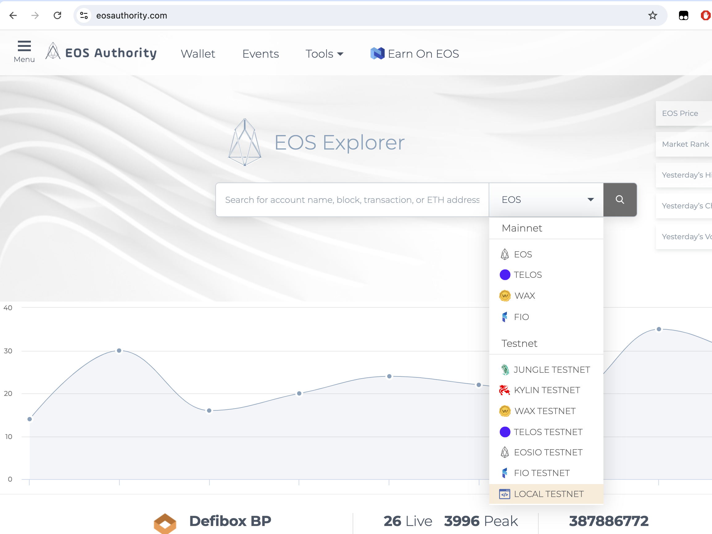
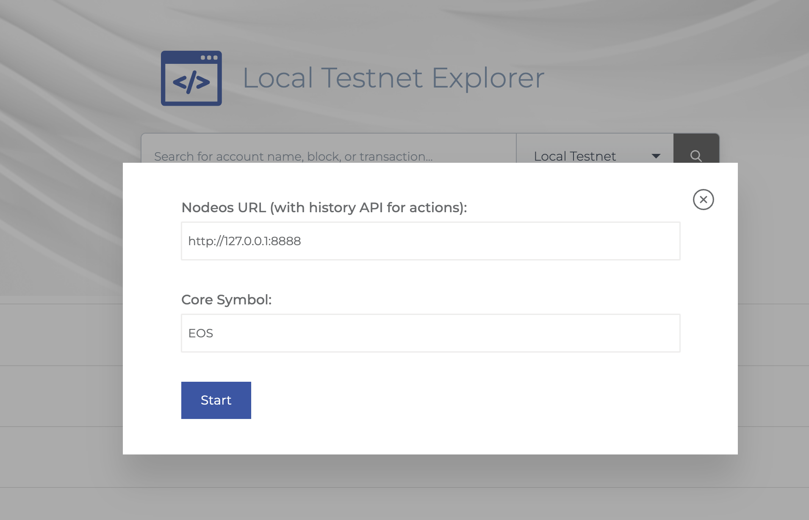
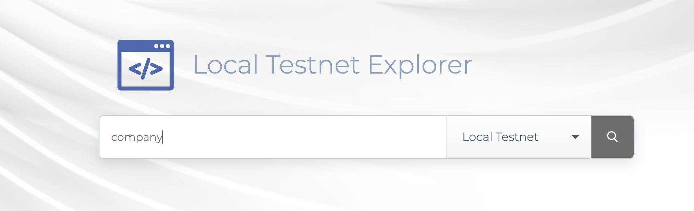
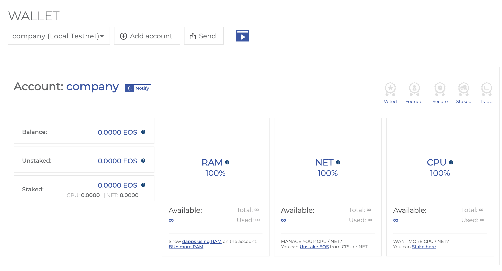

### What is a block explorer?

A block explorer is an online application that enables individuals to interact with and examine information stored on the blockchain. Such tools provide a straightforward interface for users to view transaction histories, account balances, and additional relevant data on a blockchain. Block explorers catalog and display all transactions on a specific network.

As we develop and refine our code, we'll regularly use the EOS Authority Block Explorer. This tool will be invaluable for monitoring our transactions and observing the real-time effects of our interactions with the blockchain, as well as get copy-ready `cleos` commands and inspect data in our tables.

### Using EOS Authority Block Explorer

#### Step 1: Access the Website

Begin by navigating to the [EOS Authority Block Explorer](https://eosauthority.com) website. 

#### Step 2: Select the Local Testnet

Once on the site, from the network selection dropdown menu select `Local Testnet`. This option allows you to connect to a locally running EOS-based testnet, which is ideal for development and testing purposes.

#### Step 3: Enter Your RPC URL

By default whe Once local testnet has been selected,the default RPC URL, `http://127.0.0.1:8888`. The explorer uses the RPC URL to access the RPC API, allowing it to retrieve data and interact with contracts deployed on your local Wire node.

#### Step 4: Confirm and Explore

Once connected, search for a deployed contract. Here, you can view its details, transactions, tables, and interact with its actions.

