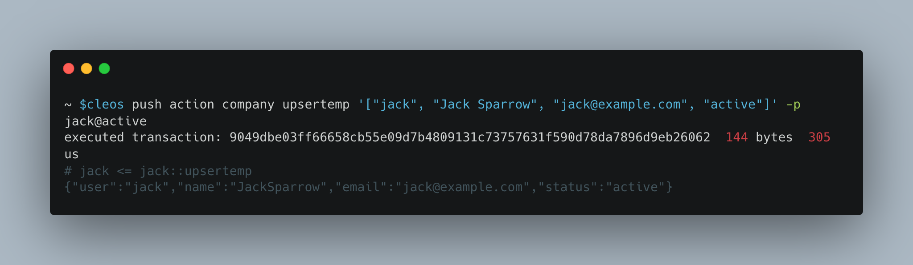
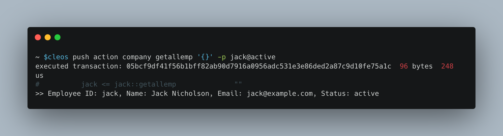
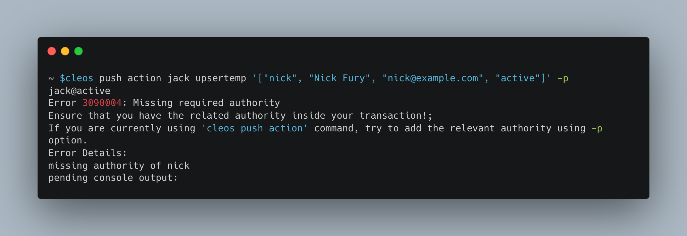

# Navigating Smart Contract Interactions with `cleos`

## Overview

In the article you’ll learn how to execute actions on a contract with the `cleos` tool. It guides you through inserting and updating records, checking updates, and testing out behavior on unauthorized change attempt.

## Prerequisites

- [Installation and Development Environment Setup](../getting-started/getting-started-intro.md)
- [Company contract tutorial](./company-contract.md)

### Step 1: Insert a record

First, let’s have Jack insert or update his own record.

```bash
cleos push action company upsertemp '["jack", "Jack Sparrow", "jack@example.com", "active"]' -p jack@active
```

Output: 

 


You could use block explorer to inspect the table and the transactions.

- image 
- image

### Step 2: Perfom an update

Next, we update Jack’s record, 

```bash
cleos push action company upsertemp '["jack", "Jack Nicholson", "jack@example.com", "active"]' -p jack@active
```

Output:

 


Post-Action Check:

 • Inspect Logs to ensure the update was executed.
 • Inspect Table to see Jack’s updated record.

### Step 3: Retrieve all users

```bash
cleos push action company get_all '{}' -p jack@active
```


Ouput: 

 

### Step 4

```bash
cleos push action company upsertemp '["nick", "Nick Fury", "nick@example.com", "active"]' -p jack@active
```

This should fail since Jack should not be able to add records for other user because the contract enforces proper authorization.


 
